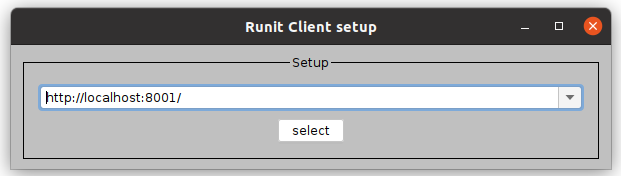
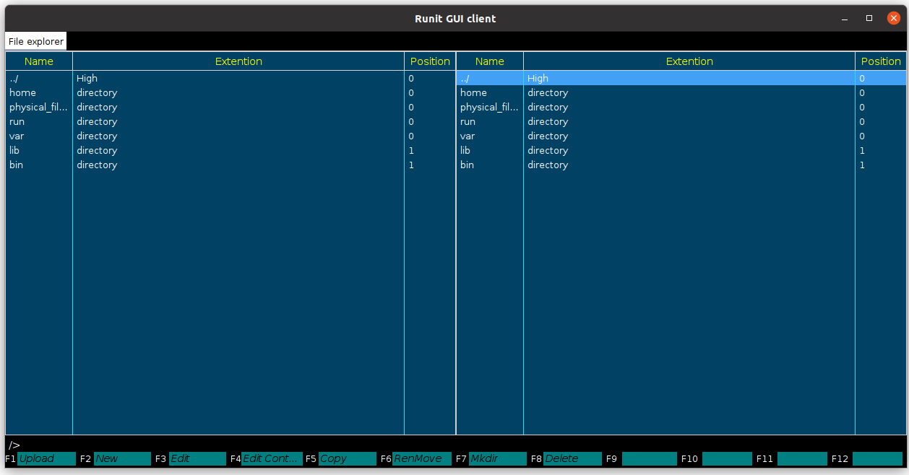
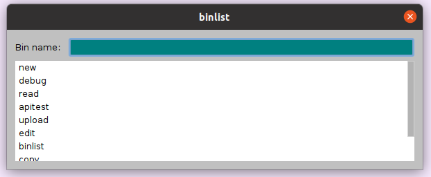
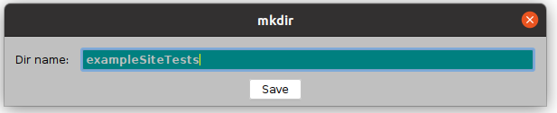
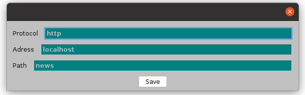
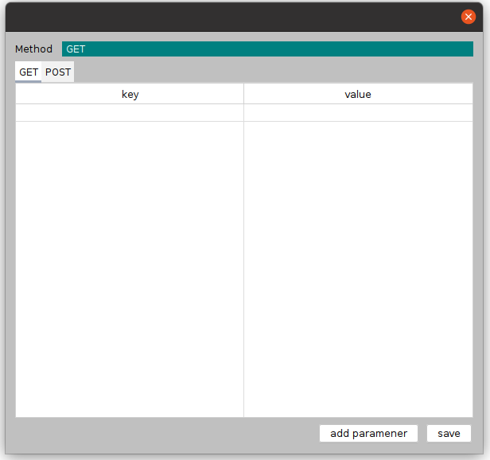
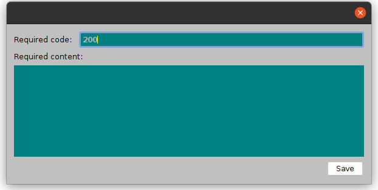
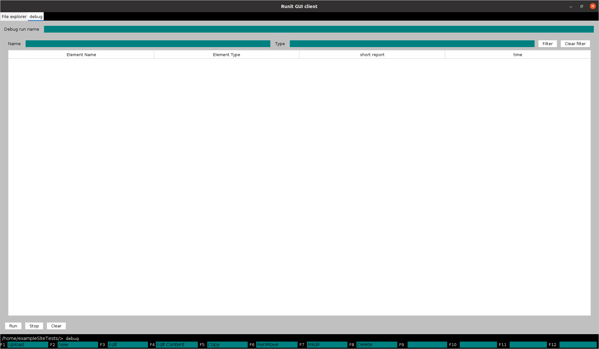
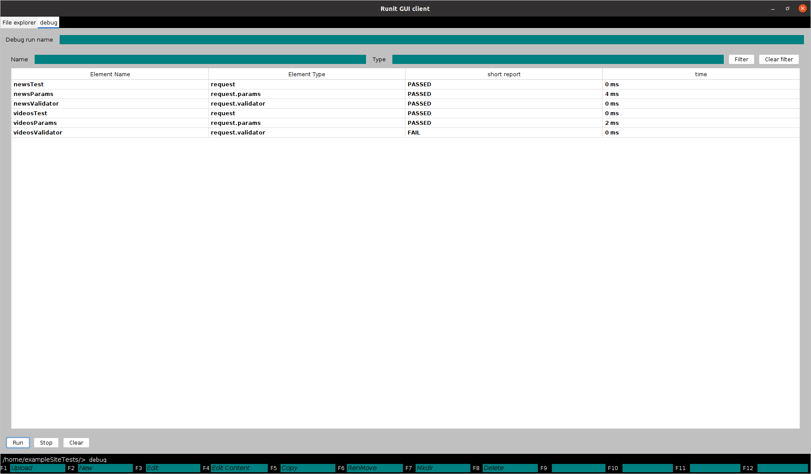

<h1>Додаткові матеріали</h1>
<hr>

##### Table of Contents  
[Headers](#headers)  
[Emphasis](#emphasis)  


<h2>Наявний функціонал</h2>
<a name="headers"></a>

<h3>Робота з файлами у клієнті</h3>

Після запуску сервера можна приступити до роботи із клієнтом. Для його запуску потрібно ввести команду:
java –jar RinitGUI-0.0.1-SNAPSHOT.jar (для Windows подвійний клік миші) після чого на екрані явиться вікно
ініціалізації клієнта, де потрібно вказати url шлях до сервера. В даному випадку це http://localhost:8001/.
Далі потрібно натиснути на кнопку &quot;select&quot;


Після чого відчиниться основне вікно програми. Воно 
складається із лівої та правої панелі файлів, під ними знаходиться командний рядок, що відображає
поточний шлях, під ним знаходиться рядок-довідка команд. Вище було сказано, що за основу клієнта було 
взято Far Manager, тому спосіб користування теж дуже схожий.[2] 

<h3>Переміщення між файлами та каталогами</h3>

На рисунку видно, що у правої панелі вибраний перший файл кореневого
каталогу (або ж на першому файлі встановлений курсор панелі). Для того, щоб
переміщуватися між файлами певної папки потрібно натиснути клавішу Arrow Up
для руху вгору, або ArrowDown для руху вниз. Якщо файл, на якому
встановлений курсор панелі також каталог, то, натиснувши Enter можна перейти у
цей каталог (поточний шлях у командному рядку змінився). Для того, щоб
перейти до попередньої папки, потрібно перейти до файлу з розширенням High, і
натиснути на нього. Оскільки панелі дві, а не одна, то можливе перемикання між
ними. Для переходу на ліву панель натисніть комбінацію клавіш Ctrl+L, а на
праву - Ctrl+R (шлях у системному рядку зміниться, якщо, і ліва, і права панелі не
знаходяться в одному каталозі)



| Команда | Дія |
| ---- | --- |
F1 | Завантажити на сервер модуль
F2 | Створити новий файл
F3 | Редагувати ім'я/розширення/позицію файлу
F4 | Редагувати вміст файлу
F5 | Копіювати файл
F6 | Перенести файл 
F7 | Створити нову папку
F8 | Видалити файл
F9 | Відкрити список виконуваних плагінів

<h3>Робота у режимі командного рядка</h3>
Оскільки всі команди неможливо вмістити, то існує режим командного рядка. Натиснувши клавішу t. поряд із поточним шляхом з'явиться курсор, і можна прописати команду mkdir або debug як буде показано у наступних розділах. Esc використовується для виходу із режиму командного рядка

<h3>Копіювання або перенесення файлу</h3>
Для того, щоб перенести файл, потрібно на одній панелі перейти до файлу, який хочете скопіювати/перенести, а на другій - туди, куди хочете скопіювати/перенести, і, повернувшись до файлу, який хочете скопіювати/перенести, і натиснути кнопку F5/F6.

<h3>Список виконуваних-плагінів</h3>
При роботі викликати плагіни через командний рядок незручно, тому було створено інший виконуваний плагін для спрощення цієй операції


<h3>Робота із функціоналом тестування</h3>
Припустимо, що потрібно протестувати сайт, що складається із двох сторінок: /news/, /videos/. Для цього в каталозі /home/ потрібно створити папку, у якій будуть знаходитись тести до даного сайту.


Назвемо цей каталог exampleSiteTests, і в ньому створимо два файли videosTest.request, newsTest.request. Ці два файли називаються файлами запиту, в них потрібно вказати протокол, домен або IP адресу та шлях. Для двох файлів протокол і адреса буде однаковою, адже тестується одний і той самий сайт. Шлях буде відрізнятися, для файлу newsTest.request - це буде /news/, a для videosTest.request - /videos/.



Далі потрібно перейти до опису параметрів запиту. Розберемо створення параметрів запиту для newsTest.request(для videosTest.request він буде схожим). Для цього потрібно встановити курсор панелі на файл videosTest.reques, і натиснути ENTER. Після цього в даній папці потрібно створити новий файл з назвою, наприклад, newsParams, обов'язково! із розширенням request.params. Відкривши цей файл за допомогою клавіші F4, можна вказати метод запиту GET/POST та вказати GET, і/або POST параметри.[2]


Також потрібно додати валідатори відповіді, для цього переходимо у файл newsParams, що також є і каталогом, та створюємо там файл newsValidator із розширенням request.validator. Відкривши його можна вказати який статус/вміст відповіді вимагається.


Після того, як пророблені вище вказані дії, потрібно повернутися у каталог exampleSiteTests, перейти у режим командного рядка і прописати команду debug. З'явиться вікно тестування. Для початку тестування потрібно прописати назву тесту і натиснути кнопку "Start"(щоб зупинити тест потрібно натиснути "Stop").



У процесі тестування в таблиці будуть з'являтися звіти від певного файлу. Від файлу newsTest.request, чи зміг він знайти щось за адресою вказаною в ньому. Від newsParams.request.params - чи було можливим зробити запит на сервер із вказаними параметрами, а від newsValidator.request.validator - чи відповідає відповідь вказаним вимогам.
Звіти можна профільтрувати по назві та розширенню. Також вікно тестування можна очистити від попереднього, натиснувши кнопку "Clear". Для того, щоб подивитися повний звіт потрібно натиснути на рядок таблиці(звіт якої потрібно подивитись звичайно ж) і натиснути ENTER, щоб відкрити файл, що при тестуванні створив даний звіт, потрібно натиснути SHIFT+ENTER.


Всі звіти зберігаються у каталозі reports, що знаходиться у тій папці, де запускалася команда debug


<h2>Розробка плагінів</h2>
Оскільки одною із вимог було легке розробка нових модулів, то був розроблений наступний 
механізм. Для розробки потрібно завантажити код із https://github.com/Zhukowych/RinitGUI, і 
відкрити його у своєму середовищі розробки (я використовую Eclipse). Потрібно знайти пакет
dev. Загальна концепція швидкої розробки така: ми пишемо мовий модуль в клонованому проекті, 
тим самим не витрачаюси часу на постійну компіляцію нового модулю, а потім, коли розробка
завершена, то всі класи плагіну експортуємо у jar-архів і завантажуємо в систему

<h3>Розробка плагіна-драйвера файлу</h3>

Як було показано вище функціонал дозволяє протестувати просту сторінку. Прийшов час розширювати
можливості. Розумним буде додати можливість тестування інтерфейсів API. А саме буде використовуватися
технологія GraphQl через свою наглядність.

Драйвер складається із двох частин: клієнтської частити, тобто інформації про те, як відображати
файли з певним розширенням, і частини, де зберігається інформація про те, як саме зберігати
данні на сервері (формат XML). Програмно ці дві чатини є наслідники класу AbstractCliDriver, 
що уособлює клієнтську частину, і наслідників AbstractDriver, що зберігає програму збирання 
і читання із сервера.

Для цього у пакеті dev.drivers потрібно створити новий пакет, в якому будуть зберігатися файли
нового модуля, назвемо його graphql. Тут також потрібно створити пакет driver для наслідника 
AbstractDriver, оскільки до нього додадуться ще декілька допоміжних. 

Тепер у dev.drivers.graphql потрібно створити файл GraphqlCliDriver.java і унаслідувати цей
клад від AbstractCliDriver. Потрібно буде ще реалізувати декілька методів:

| Назва методу | призначення |
| ---- | --- |
|getName | розширення файлу, файли якого зможе читати данний драйвер|
|getView | графічне представлення файлу, для його читання та редагування|
|isPopup | якщо файл, то чи відкривати під це окреме вікно|
|getPopUpSize | розмір вікна, якщо таке відкривається|
|isDirable | чи файл може бути каталогом|
|getDriver | посилення на клас наслідника AbstractDriver|

Також потрібно додати два конструктори: по замовчуваню, та, який приймає два параметри:
FileDTO readingFile, ModelFacade modelFacade. readingFile - це клас запису файлу в базі
данних, який користувач відкрив для читання/запису. modelFacade - це клас який забезпечує 
управління певними частинами клієнта(документація до нього буде додана нижче). Клас 
FileDTO зберігає в собі такі поля, як id, name, extention, path, position, content, гетери
і сетери до цих полів. Крім того потрібно створити клас-відображення. Назвемо його 
GraphqlCliDriverView.java, його потрібно наслідувати від класу AbstractCliDriverView. Після 
реалізації всіх методів файл GraphqlCliDriver.java буде виглядати так:

```java
package com.rinit.gui.dev.drivers.graphql;

\\ імпотрти приховані

public class GraphqlCliDriver extends AbstractCliDriver {

    private static final long serialVersionUID = 1780372510614788486L;

    public static final String NAME = "graphql";
    
    private GraphqlCliDriverLogic logic;
    private AbstractCliDriverView view;
    
    public GraphqlCliDriver() {}
    
    public GraphqlCliDriver(FileDTO readingFile, ModelFacade modelFacade) {
        super(readingFile, modelFacade);
        this.logic = new GraphqlCliDriverLogic(readingFile, modelFacade);
        this.view = new GraphqlCliDriverView(logic);
    }
    
    @Override
    public String getName() {
        return NAME;
    }

    @Override
    public AbstractCliDriverView getView() {
        return this.view;
    }

    @Override
    public boolean isPopup() {
        return true;
    }

    @Override
    public Dimension getPopUpSize() {
        return null;
    }
    
    @Override
    public boolean isDirable() {
        return true;
    }

    @Override
    public Class<? extends AbstractDriver> getDriver() {
        return GraphqlDriver.class;
    }
    
}
```

Як видно додано ще декілька класів: GraphqlCliDriverView, що є відображенням, і 
GraphqlCliDriverLogic. Останній виконує роль логіки відображення, тому що для успішної розробки 
такого роду застосунків важливо, щоб частина програми, яка безпосередньо займається побудовою 
графійного інтерфейсу була відокремлена від того, що саме потрібно робити, коли натискаєш кнопку 
"зберегти".

Не буде продставлено повністю вміст файлів GraphqlCliDriverView та GraphqlCLiDriverLogic,
через те, що їх зміст не є важливим для розкриття теми. 

Далі потрібно створити клас, що буде читати/записувати данні у базу данних. Назвемо його 
GraphqlDriver.java, наслідуємо його від AbstractDriver. Потрібно реалізувати два методи:
buildFromDTO та buildContent. Перший займається тим, що бере данні із текстової стрічки, і
заносить їх у java-об'єкт. buildContent має  взяти поточні данні об'єкта, і на їх основі 
створити текстову-стрічку, яку потім запишуть у базу данних. 

Тепер потрібно визначитись із спеціальними данними, які повинен зберігати graphql запит. Для 
наочності припустимо, що такий запит має в собі тільки рядок graphql-запиту, який містить 
інформацію про данні, що сервер має повернути. Тому в клас GraphqlDriver потрібно додати 
поле, що буде зберігати цей запит, гетери, сетери до нього. 

Також потрібно реалізувати методи buildFromDTO та buildContent. Після виконання всього вище
сказаного клас набуде наступного вигляду. Для використання данніго класу у цілях тестування
потрібно заімплементувати його від інтерфейсу DebuggerDriver.

```java
package com.rinit.gui.dev.drivers.graphql.driver;

// імпорти приховані

public class GraphqlDriver extends AbstractDriver implements DebuggerDriver {
    
    private String query;
    
    public String getQuery() {
        return query;
    }
    
    public void setQuery(String query) {
        this.query = query;
    }
    
    @Override                           
    protected void buildFromDTO() {     
        XMLReader reader = new XMLReader(this.getContent());
        this.setQuery(reader.getTagValueByName("query", "graphql"));
    }
    
    @Override
    public String buildContent() {
        XMLBuilder builder = new XMLBuilder();
        return builder.addTag("graphql", builder.addTag("query", this.getQuery()));
    }
    
    @Override
    public void run(RunContext context) {
        ReportContext reportContext = context.getContext(ReportContext.class);
        ReportItem report = ReportItem.createDefaultReport(this);
        report.shortReport = ""; // корокий звіт
        report.fullReport = ""; // повнй звіт
        reportContext.addReport(report);        
    }

    @Override
    public void outRun(RunContext context) {
        // TODO Auto-generated method stub
        
    }

}
```

Стрічка, що є вмістом файлу має xml формат, тому для запису/читання можна використовувати
будь-яку бібліотеку. Після того, як данні із графічного інтерфейсу зчитані можна приступити до 
збереження файлу у базу данних

```java
  private void save() {
      IFileService fileService = modelFacade.getRinitClientModel() \
          .getClient().getFileService();
      /* отримати доступ до файлового сервісу */
      GraphqlDriver file = new GraphqlDriver();
      file.fromDTO(readingFile); 
      /* прочитати ім'я, розширення, шлях із файлу, що 
      відкрили для читання */
      file.setQuery(/* graphql-запит прочитаний із графічного інтерфейсу*/);
      fileService.saveFile(file);
      /* зберегти файл у файловому сервісі */
  }
```

Після відтворення цих дій ви можете скомпілювати класи у jar-файл, і завантажити на сервер, 
задопомогою команди F1

<h3>Розробка виконуваного плагіну</h3>

Взагальному розробка виконуваниго плагіну виглядає так же як і з плагіна-драйвера файлу, проте, код буде виглядати по-іншому.
Для розробці в пакеті dev.bin додється новий пакет, в якому буде проходити створення розширення. Додається Як мінімум три класи - 
який наслідується від AbstractCliBin й повинен імплементувати наступні методи:

| Назва методу | призначення |
| ---- | --- |
|getName | назва плагіну-драйверу |
|getView | графічне представлення виконуваного плагіна |
|isPopup | чи створювати нове вікно |
|getPopUpSize | якщо створювати нове вікно, якого воно має бути розміру |
| visible | чи відкривати графічне представлення |
| getKeyBinding | яку клавішу використовувати для запуску виконуваного плагіну  |

Після завершення робіт також архівуються усі файли у jar архів і завантажуються в систему
